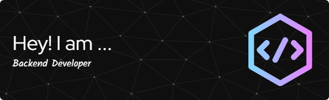

# 💫 About Me:
Passionate about building scalable, high-performance applications, I specialize in backend development, API design, and cloud-based solutions. My expertise lies in crafting efficient, secure, and optimized systems that drive seamless user experiences.  With a strong foundation in software architecture and problem-solving, I enjoy working on real-time applications, automation, and cloud integrations. I thrive on tackling complex challenges, optimizing performance, and exploring cutting-edge technologies to push the boundaries of development.  I'm always open to collaborating on exciting projects, contributing to open-source, and learning new technologies to stay ahead in the ever-evolving tech landscape.

## 🌐 Socials:
  
# 💻 Tech Stack:
                                  

# 📊 GitHub Stats:
 
 

<picture>
  <source media="(prefers-color-scheme: dark)" srcset="https://raw.githubusercontent.com/anuragj-2003/anuragj-2003/output/github-snake-dark.svg" />
  <source media="(prefers-color-scheme: light)" srcset="https://raw.githubusercontent.com/anuragj-2003/anuragj-2003/output/github-snake.svg" />
  
</picture>

### ✍️ Random Dev Quote

---

